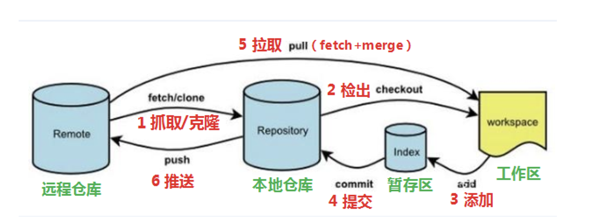

# hello-world

此存储库用于练习 GitHub 流<br>

## 1. 注意事项

- 这句是readme-edits 分支上的第一次修改，记得将本地git默认的master分支重命名为main，与远程保持一致哦。
- 将本地master分支重命名为main分支： git branch -m master main。
- readme-edit分支修改README文件，master分支修改txt文件，最后合并到main分支中。
-  git add (工作区 --> 暂存区) 。
- git commit (暂存区 --> 本地仓库)。

## 2. Git工作流程图



> 黄色代码步骤是 从本地上传内容到远程仓库

0. ==本地初始化仓库：git init，本地会生成 .git 或者 .github 的文件，然后关联远程仓库：git remote add origin url // origin 远程仓库端口名，url远程仓库地址==

1.  clone（克隆）: 从远程仓库中克隆代码到本地仓库

2. checkout （检出）:从本地仓库中检出一个仓库分支然后进行修订

3. ==add（添加）: git add .  在提交前先将本地代码提交到暂存区==

4. ==commit（提交）: git commit -m ‘first commit’  将暂存区内容提交到本地仓库，并添加注释说明。本地仓库中保存修改的各个历史版本==

5.  pull (拉取) ： 从远程库拉到本地库，自动进行合并(merge)，然后放到到工作区，相当于 fetch+merge

	```c
	从远程main分支拉取到本地的dev分支:
	git pull origin main/dev
	```

6.  ==push（推送） : 推送本地分支的内容到远程仓库对应的分支内==，如果远程分支名和本地分支名称相同，则可以只写本地分支：git push origin main(将main分支推送到已经关联的远端分支)


